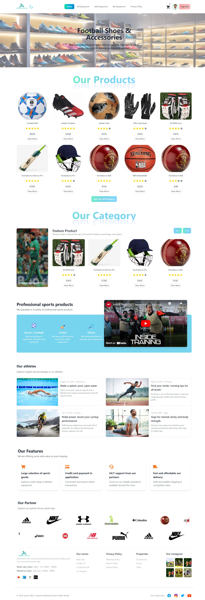
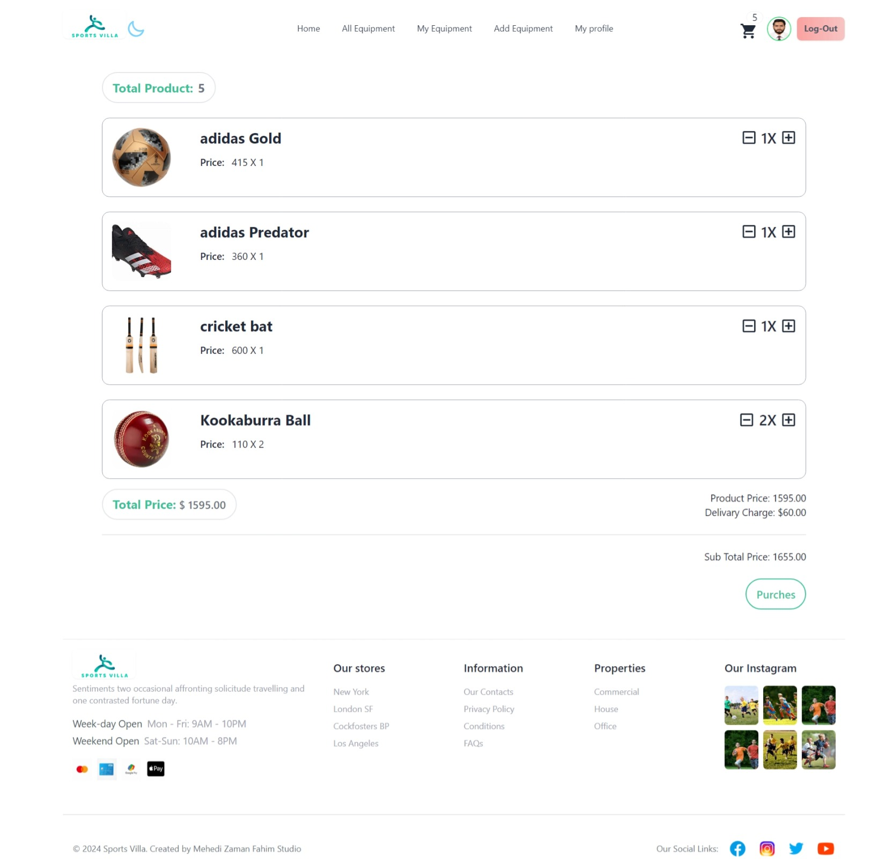

# Project Name: Sports Villa (Sports Villa Website).

## Short Description:

Sports Villa Website designed Sports Equipment Online Store. This is a sports accessories e-commerce website, a platform where customers can browse, purchase, and review various sports accessories, from gear to apparel, catering to different sports disciplines. The website will support user authentication and product management.

## List of React Fundamental concepts used in the project

1. **JSX (JavaScript XML)**
2. **Components**
3. **Props**
4. **State**
5. **Event Handling**
6. **Conditional Rendering**
7. **useEffect Hook**
8. **CReact Router (Routing)**
9. **Conditional Rendering**
10. **Express**
11. **MongoDb**

## List of npm packge

1. **animate.css**
2. **firebase**
3. **moment**
4. **react-countdown**
5. **react-fast-marquee**
6. **react-headroom**
7. **react-responsive-carousel**
8. **react-scroll-to-top**
9. **react-toastify**
10. **swiper**
11. **react-icons**
12. **recharts**
13. **react-helmet**
14. **React Awesome Reveal**
15. **React Tooltip**

## Requirement Document

[Requirement Document Link](https://docs.google.com/document/d/1zl97jEDUtdadOGwHSV_fP1gShCwCxwk6DDhQbEpcfHY/edit?tab=t.0).

## Live Link Firebase deploy

[Career Consult Web App](https://sports-villa-54185.web.app/).

## Live Link Surge deploy

[Career Consult Web App](https://mz-sports-villa.surge.sh/).

### Preview

